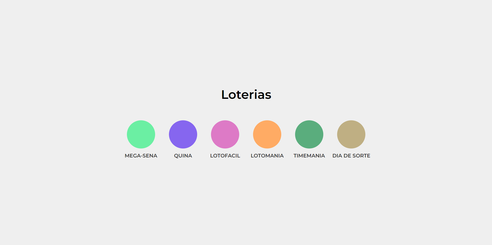
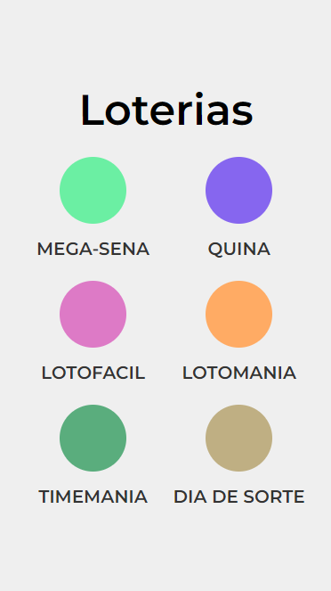
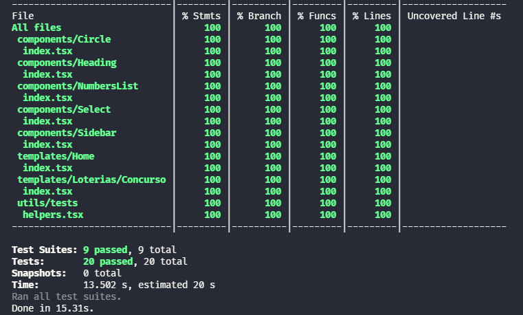

# Brainnco Front-end challenge

Uma **aplicação web front-end** que mostra **Resultados das loterias**.

Site: https://brainnco-frontend-challenge-washington.vercel.app

#### Desktop:




#### Desktop:




---
## Tecnologias e ferramentas

- NextJs
- Typescript
- React-testing-library
- Styled-components
- Styled-media-query
- Eslint
- Prettier
- Husky
- Lint-staged

### Escolha das tecnologias

NextJS: Foi escolhido usar NextJs nessa aplicações devido a facilidade e  produtividade que ele propoem com relações a rotas, performance e métodos para **data fetching** como o **getStaticProps** e **getStaticPaths** que foram usados.

Typescript: O typescript além de ser um requisito do desafio ajuda muito em questões de typagem e intellisense, dando assim mais segurança e maior produtividade no desenvolvimento.

Styled-components: O styled-components foi escolhido devido sua facilidade para modificação do css através de props sendo assim faciltando a criação de componentes mais genéricos como foi o caso do **Heading** e do **Circle**.

---
### Cobertura de código



---

### Como rodar o projeto

Para rodar o projeto clone esse repositório no seu terminal e entre no diretório do projeto, após isso instale todas as dependencias necessárias com o comando abaixo:

```
npm install
```
ou
```
yarn
```

Após a instalação das dependencias rode o projeto com o comando abaixo:

```
npm run dev
```
ou
```
yarn dev
```

Então digite a seguinte URL no seu navegador:

```
http://localhost:3000
```

---

made by Washington with ❤️.
